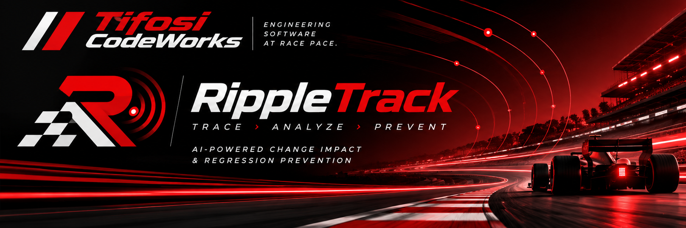
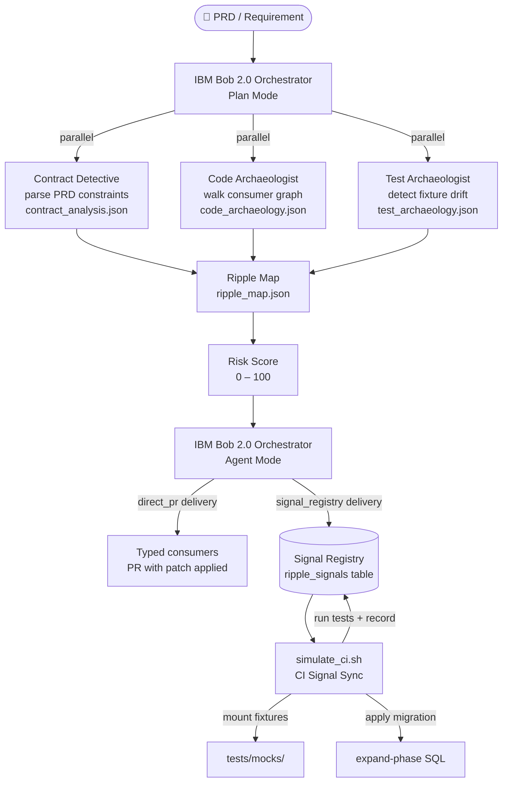

# RippleTrack
### *Every change leaves a signal. Track the ripple.*

---



[Watch the demo](https://youtu.be/2J5eDVudVGU)

---

<div align="center">

[](https://lablab.ai)
[](https://lablab.ai)
[](#license)
[](https://nodejs.org)
[](https://react.dev)
[](https://typescriptlang.org)
[](https://github.com/WiseLibs/better-sqlite3)

</div>

---

## Table of Contents

1. [Problem / Solution](#problem--solution)
2. [Architecture Overview](#architecture-overview)
3. [Tech Stack](#tech-stack)
4. [Local Setup](#local-setup)
5. [Running the Demo](#running-the-demo)
6. [Signal Registry — `ripple_signals` Table](#signal-registry--ripple_signals-table)
7. [How IBM Bob 2.0 Was Used](#how-ibm-bob-20-was-used)
8. [Known Limitations & Future Scope](#known-limitations--future-scope)
9. [Team Credits](#team-credits)
10. [License](#license)

---

## Problem / Solution

### The Problem

Engineering teams running AI-accelerated delivery hit a silent regression trap: a model field is added, an interface drifts, a test fixture goes stale, a migration ships without a default — and none of it produces a compile error or a red CI bar. The change lands in production, downstream consumers throw at runtime, and the root cause was invisible at the moment the PRD was written.

The trap is structural. No single agent has the full picture: Contract Detective knows the requirement, Code Archaeologist knows the consumer graph, Test Archaeologist knows which mocks are stale. Without a shared picture, each agent ships into a blind spot.

### The Solution

RippleTrack runs three IBM Bob 2.0 subagents **in parallel** during Plan Mode — Contract Detective, Code Archaeologist, and Test Archaeologist — to produce a **Ripple Map** and a **Risk Score** before a single line of code is written. Agent Mode then executes the changes bilaterally: direct-PR delivery for typed consumers, Signal Registry delivery for untyped ones. The result is written to the **Signal Registry** (`ripple_signals` table), where a CI Signal Sync step mounts fixtures, applies migrations, and records the outcome as an append-only run history row — closing the loop from requirement to safe deployment.

---

## Architecture Overview

### Parallel Subagent Analysis (Plan Mode → Agent Mode)



### End-to-End User Flow

```
Home Page (/)
  └─ Introduces three subagents + flow overview
  └─ "View Dashboard" CTA ──► New Analysis Page
        └─ Select PRD from library  ──► Plan Mode runs
              └─ Ripple Map + Risk Score rendered
                    └─ Agent Mode executes ──► Signal Registry written
                          └─ Run History ──► Dashboard per run
                                └─ simulate_ci.sh ──► CI Signal Sync recorded
```

**Home page** (`/`) serves as the project's entry point: it introduces the three parallel subagents, explains the Plan Mode → Ripple Map / Risk Score → Agent Mode → Signal Sync flow, and provides a **"View Dashboard"** CTA that drops directly into the analysis dashboard where all the existing subagent and CI functionality lives, unchanged.

---

## Tech Stack

### Backend

| Package | Version | Role |
|---|---|---|
| `express` | ^5.2.1 | REST API server |
| `better-sqlite3` | ^13.0.3 | SQLite driver — Signal Registry |
| `multer` | ^2.4.0 | PRD file upload handling |
| `uuid` | ^14.0.2 | Unique run / signal IDs |
| `cors` | ^2.8.6 | Cross-origin support for Vite dev server |

### Frontend

| Package | Version | Role |
|---|---|---|
| `react` | ^19.2.8 | UI framework |
| `react-dom` | ^19.2.8 | DOM renderer |
| `@xyflow/react` | ^12.12.0 | Ripple Map graph visualisation |
| `reactflow` | ^11.11.4 | ReactFlow v11 (legacy compat layer) |
| `lucide-react` | ^1.48.0 | Icon set |
| `vite` | ^8.3.0 | Dev server + build tool |
| `typescript` | ~6.0.2 | Type safety |
| `oxlint` | ^1.81.0 | Linter |

### Test / Dev

| Package | Version | Role |
|---|---|---|
| `vitest` | ^5.0.2 | Unit test runner |

### Infrastructure

| Tool | Role |
|---|---|
| SQLite (file: `db/ripple_signals.db`) | Signal Registry persistent store |
| `simulate_ci.sh` | Bash CI Signal Sync harness |
| `db/setup.sql` | Schema bootstrap + demo seed row |

---

## Local Setup

### Prerequisites

- Node.js ≥ 18
- `sqlite3` CLI (required for `simulate_ci.sh`)
- npm ≥ 9
- Bash-compatible shell (for `simulate_ci.sh`; Git Bash / WSL on Windows)

### Steps

```bash
# 1. Clone the repository
git clone https://github.com/<your-org>/rippletrack-demo.git
cd rippletrack-demo

# 2. Install root (backend) dependencies
npm install

# 3. Install frontend dependencies
npm install --prefix frontend

# 4. Bootstrap the Signal Registry database
sqlite3 db/ripple_signals.db < db/setup.sql
# The schema and demo seed row (RT-8821 / PROJ-8821) are created automatically.
# Verify: sqlite3 db/ripple_signals.db "SELECT id, risk_score, status FROM ripple_signals;"

# 5. Environment variables
# No .env file is required for the demo — all defaults are hard-coded in server/index.js.
# PORT defaults to 3001.  To override:
#   PORT=4000 npm run start:api
```

> **`.bobignore` / `.gitignore`**  
> Both files exclude `.env`, `node_modules/`, and `*.db` — the SQLite database is local-only
> and is never committed. Re-run `sqlite3 db/ripple_signals.db < db/setup.sql` any time you
> need to reset the Signal Registry to the demo seed state.

---

## Running the Demo

### 1 — Start the servers

```bash
# Option A: start both API and frontend together (background processes)
npm run dev

# Option B: start separately (two terminals)
npm run start:api      # Express API on http://localhost:3001
npm run start:frontend # Vite dev server on http://localhost:5173
```

### 2 — Open the home page

Navigate to **http://localhost:5173** in your browser.

The home page (`/`) introduces RippleTrack, shows the three parallel subagents (Contract Detective, Code Archaeologist, Test Archaeologist), and explains the Plan Mode → Ripple Map / Risk Score → Agent Mode → Signal Sync workflow. Click **"View Dashboard"** to enter the analysis dashboard.

### 3 — Select a PRD from the library

On the **New Analysis** page, the pre-built PRD library contains seven curated scenarios:

| PRD | Description | Expected Risk |
|---|---|---|
| `requirements_v3.docx` | UserProfile · `preferredLanguage` — full demo scenario (RT-8821) | **High (100)** |
| `requirements_prd1_low_risk.docx` | Copy-only display name change | Low (12) |
| `requirements_prd2_high_risk.docx` | Multi-field breaking change on OrderModel | High |
| `requirements_prd3_schema_drift.docx` | ProductCatalog — 3 undeclared production fields | Medium |
| `requirements_prd4_mock_drift.docx` | NotificationService — stale fixture, 3 sprints | Medium |
| `requirements_prd5_no_risk.docx` | Documentation-only update — zero findings | Low (0) |
| `requirements_prd6_ambiguous.docx` | Ambiguous / contradictory constraints | Medium |

Select **`requirements_v3.docx`** for the primary demo scenario, then click **Run Analysis**.

### 4 — Watch Plan Mode run the three subagents in parallel

The dashboard shows live progress as Contract Detective, Code Archaeologist, and Test Archaeologist run concurrently. When complete, their outputs are merged into:

- **Ripple Map** — interactive dependency graph (ReactFlow) showing the model node, its two consumers, fixture, and test file, each annotated with risk flags.
- **Risk Score** — 0–100 composite score with a per-factor breakdown (shared model touched, schema drift vs PRD, fixture drift, untyped consumers, no default, no test coverage). For RT-8821 this scores **100 / 100**.

### 5 — Review the Dashboard

The Dashboard tab shows:
- The rendered **Ripple Map** graph
- Risk Score gauge and factor breakdown
- Signal payload summary (migration strategy, mock updates, downstream guards)

### 6 — Run the CI Signal Sync simulation

```bash
# From the repo root — requires sqlite3 on PATH
bash simulate_ci.sh

# Or pass the ticket explicitly:
CI_TICKET_ID=PROJ-8821 bash simulate_ci.sh
```

The script runs five stages:

| Stage | What it does |
|---|---|
| **1 — Query Signal Registry** | Reads the `ripple_signals` row for ticket `PROJ-8821` |
| **2 — Mount mock updates** | Writes `preferredLanguage: "en-US"` into `tests/mocks/userFixture.json` |
| **3 — Apply migration** | Runs the expand-phase `ALTER TABLE` against a throwaway `ci_test_dummy.db` |
| **4 — Run test suite** | Executes `npm test` (Vitest) |
| **5 — Record CI run** | INSERTs an append-only history row into `ripple_signals` with `status = MOUNTED_IN_CI` |

After the script completes, reload the **Run History** page in the dashboard to see the new CI run row.

---

## Signal Registry — `ripple_signals` Table

The `ripple_signals` table is the append-only ledger at the heart of RippleTrack's **Bilateral Delivery** model.

```sql
CREATE TABLE IF NOT EXISTS ripple_signals (
    id                  TEXT PRIMARY KEY,
    feature_ticket_id   TEXT NOT NULL,
    target_commit_sha   TEXT,
    ripple_map_summary  JSON NOT NULL,   -- serialized dependency graph
    risk_score          INTEGER NOT NULL, -- 0–100

    -- Safe migration artifact
    migration_payload   TEXT,            -- e.g. ALTER TABLE users ADD COLUMN preferred_language TEXT DEFAULT 'en-US'
    migration_strategy  TEXT,            -- 'EXPAND_PHASE_ONLY'

    -- Mock & fixture sync
    mock_updates        JSON,            -- path → fixture patch mapping for CI mounting

    -- Defensive runtime guards
    downstream_guards   JSON,            -- AST-targeted null-safety patches for consumers

    status              TEXT DEFAULT 'PENDING', -- PENDING | MOUNTED_IN_CI | DEPLOYED
    created_at          TIMESTAMP DEFAULT CURRENT_TIMESTAMP
);
```

### Column Purpose

| Column | Purpose |
|---|---|
| `id` | Unique signal or CI-run identifier (e.g. `RT-8821`, `ci-run-20260926T...`) |
| `feature_ticket_id` | Links the signal back to the originating PRD ticket (e.g. `PROJ-8821`) |
| `target_commit_sha` | Git SHA of the commit that triggered the analysis |
| `ripple_map_summary` | Serialised JSON dependency graph — nodes, children, risk flags |
| `risk_score` | Composite 0–100 score produced by the three parallel subagents |
| `migration_payload` | Safe expand-phase SQL (e.g. `ALTER TABLE … ADD COLUMN … DEFAULT`) |
| `migration_strategy` | Delivery strategy, currently `EXPAND_PHASE_ONLY` |
| `mock_updates` | JSON map of fixture paths → patch objects, consumed by `simulate_ci.sh` Stage 2 |
| `downstream_guards` | AST-level null-safety patches for untyped consumers (e.g. `eventTracker.ts`) |
| `status` | Lifecycle state: `PENDING` → `MOUNTED_IN_CI` → `DEPLOYED` |

### Bilateral Delivery Model

RippleTrack distinguishes two delivery channels based on how well a consumer is typed:

- **Direct PR delivery** — typed consumers that have a compile-time binding to the model (e.g. `src/api/userRouter.ts` post-fix) receive the change as a standard pull request. Bob writes the patch inline.
- **Signal Registry delivery** — untyped consumers (e.g. `src/analytics/eventTracker.ts`, which accepts `Record<string,any>`) are too risky to patch blindly. Instead, the signal payload is written to `ripple_signals`. The CI hook reads it at build time, mounts the updated fixtures, applies the migration, and records the outcome — all without touching the consumer's source directly until a human review confirms safety.

This bilateral split is the core architectural insight: not every downstream consumer can accept a direct-code delivery; the Signal Registry provides the safe fallback path.

---

## How IBM Bob 2.0 Was Used

RippleTrack uses IBM Bob 2.0 as its **orchestration layer** across both major phases of the workflow.

### Plan Mode — Parallel Subagent Analysis

Bob's Plan Mode is used to launch three specialised subagents **in parallel** for every PRD that enters the system:

1. **Contract Detective** — parses the PRD document, extracts field constraints, optionality rules, and default values, and produces `plan/contract_analysis.json`.
2. **Code Archaeologist** — walks the target repository's consumer graph starting from the affected model, flags untyped consumers, unsafe casts, and live type-safety gaps. Produces `plan/code_archaeology.json`.
3. **Test Archaeologist** — inspects test fixture files and test coverage, identifies stale mocks, missing schema validators, and tests that would silently miss a new field. Produces `plan/test_archaeology.json`.

Bob merges the three outputs into a single **Ripple Map** (`plan/ripple_map.json`) and a composite **Risk Score** (0–100 with per-factor breakdown). This all happens *before any code is written* — the plan is the guard rail.

### Agent Mode — Bilateral Execution

Once the Ripple Map and Risk Score are confirmed, Bob's Agent Mode executes the delivery:

- For **typed consumers** (direct PR path), Bob applies the patch inline and opens a pull request.
- For **untyped consumers** (Signal Registry path), Bob writes the full signal payload — migration SQL, fixture patch, downstream null-safety guard — to the `ripple_signals` table. The `simulate_ci.sh` harness then consumes that payload at CI time, applying changes only after the test suite confirms safety.

The combination of Plan Mode (parallel analysis) and Agent Mode (bilateral execution) is what makes RippleTrack's guarantee possible: *every downstream node has an explicit, auditable delivery path before the first line ships.*

---

## Known Limitations & Future Scope

### Current Demo Constraints

- **Curated PRD library only.** The primary demo operates from the seven pre-loaded `.docx` files in `requirements/`. A manual PRD upload option is also available (Advanced Mode in the New Analysis page), but fully arbitrary, unstructured PRD ingestion — with no pre-computed plan directory — produces synthetic analysis results rather than a real subagent run. Production-quality ingestion of arbitrary PRDs is not yet implemented.
- **Single target repository.** The demo is wired to the `rippletrack-demo` repo. Multi-repo target support is scaffolded in `server/prd-library.js` (`TARGET_REPOS`) but not yet surfaced in the UI.
- **SQLite-only Signal Registry.** The `ripple_signals` table runs on a local SQLite file. A production deployment would require a Postgres or other managed database.
- **Simulated agent delays.** Agent progress in the UI uses deterministic delays (`AGENT_DELAYS_MS`) rather than live Bob API calls; the plan files on disk represent the pre-computed real outputs.

### Future Scope

- **IDE extension.** Package RippleTrack as a VS Code (or JetBrains) extension so developers get a Ripple Map inline at the moment they touch a model file — no separate UI required.
- **Version-control integration.** Offer RippleTrack as a CI/VCS hook or a native GitHub / GitLab app — a `ripple-check` status that runs on every PR touching a declared model, blocking merge if the Risk Score exceeds a configurable threshold without a confirmed Signal Registry entry.
- **Arbitrary PRD ingestion.** Full natural-language PRD parsing (not just `.docx` with pre-computed plans) so any team can drop in their own requirements document without pre-configuration.
- **Contract phase automation.** Automate the deferred contract phase of expand-phase migrations (DROP DEFAULT, enforce NOT NULL) once downstream traffic data confirms safe backfill.

---

## Team Credits

**Tifosi CodeWorks**

| | |
|---|---|
| **Smiti** | Architecture, Subagent Design, Signal Registry Schema, Frontend,  Dashboard UI |
| **Harsh** | Architecture, Analysis Engine, PRD library, Server API, CI Signal Sync |

---

> Built for the **IBM BOB 2.0 Hackathon** — hosted by [lablab.ai](https://lablab.ai), **Sept 25–27, 2026**.

---

## License

```
MIT License

Copyright (c) 2026 Tifosi CodeWorks

Permission is hereby granted, free of charge, to any person obtaining a copy
of this software and associated documentation files (the "Software"), to deal
in the Software without restriction, including without limitation the rights
to use, copy, modify, merge, publish, distribute, sublicense, and/or sell
copies of the Software, and to permit persons to whom the Software is
furnished to do so, subject to the following conditions:

The above copyright notice and this permission notice shall be included in all
copies or substantial portions of the Software.

THE SOFTWARE IS PROVIDED "AS IS", WITHOUT WARRANTY OF ANY KIND, EXPRESS OR
IMPLIED, INCLUDING BUT NOT LIMITED TO THE WARRANTIES OF MERCHANTABILITY,
FITNESS FOR A PARTICULAR PURPOSE AND NONINFRINGEMENT. IN NO EVENT SHALL THE
AUTHORS OR COPYRIGHT HOLDERS BE LIABLE FOR ANY CLAIM, DAMAGES OR OTHER
LIABILITY, WHETHER IN AN ACTION OF CONTRACT, TORT OR OTHERWISE, ARISING FROM,
OUT OF OR IN CONNECTION WITH THE SOFTWARE OR THE USE OR OTHER DEALINGS IN THE
SOFTWARE.
```

---

<div align="center">
  <sub>RippleTrack · Tifosi CodeWorks · IBM Bob 2.0 Hackathon 2026</sub>
</div>
